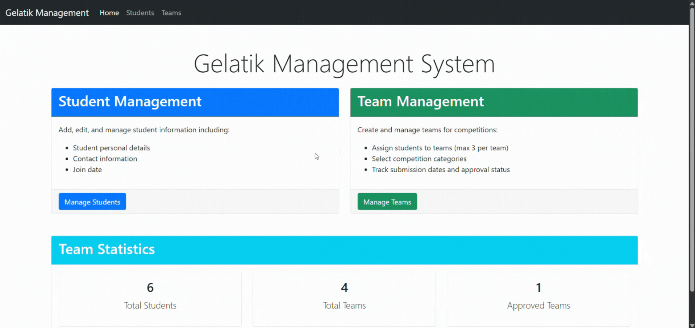
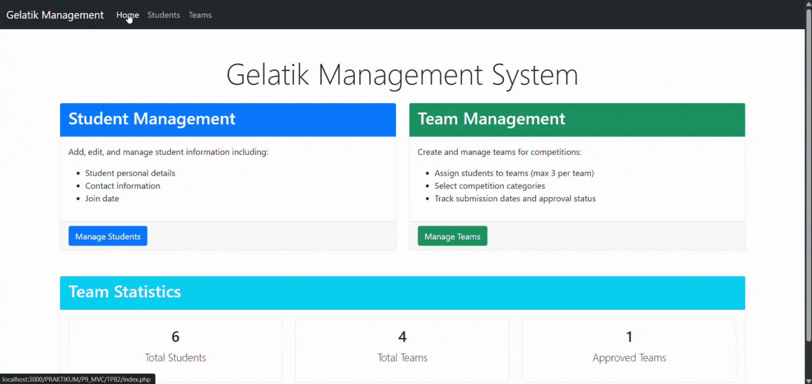
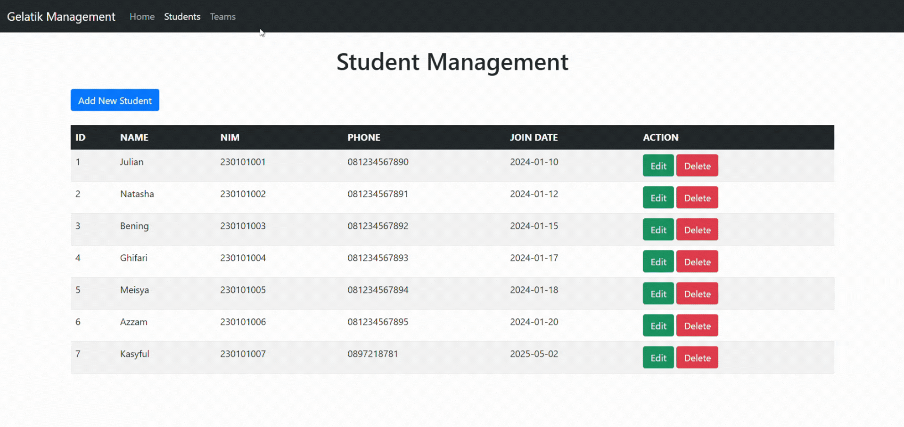

# Janji
Saya Nuansa Bening Aura Jelita dengan NIM 2301410 mengerjakan Tugas Praktikum 8 dalam mata kuliah Desain dan Pemrograman Berorientasi Objek 
untuk keberkahanNya maka saya tidak melakukan kecurangan seperti yang telah dispesifikasikan. Aamiin.

# Desain Program 
Program ini berbasis PHP dengan arsitektur MVC untuk mengelola Kompetisi Pagelaran Sains Data, Inovasi Digital dan TIK (GELATIK). Pengelolaan tersebut beruapa mahasiswa dan tim yang berpartisipasi dalam berbagai kategori lomba yang ada.

## Desain Database

### Database: `gelatik`

#### Tabel: `students`
| Kolom | Tipe | Deskripsi |
|--------|------|-------------|
| id | INT (AUTO_INCREMENT, PK) | Identifikasi unik untuk setiap mahasiswa |
| name | VARCHAR(100) | Nama lengkap mahasiswa |
| nim | VARCHAR(20) | Nomor Induk Mahasiswa |
| phone | VARCHAR(15) | Nomor kontak mahasiswa |
| join_date | DATE | Tanggal pendaftaran mahasiswa |

#### Tabel: `team`
| Kolom | Tipe | Deskripsi |
|--------|------|-------------|
| id | INT (AUTO_INCREMENT, PK) | Identifikasi unik untuk setiap tim |
| team_name | VARCHAR(100) | Nama tim |
| category | VARCHAR(100) | Kategori lomba |
| title | VARCHAR(200) | Judul proyek |
| submission_date | DATE | Tanggal pengajuan proyek |
| status | VARCHAR(20) | Status tim (Pending/Approved) |

#### Tabel: `team_member`
| Kolom | Tipe | Deskripsi |
|--------|------|-------------|
| id | INT (AUTO_INCREMENT, PK) | Identifikasi unik untuk setiap hubungan tim-anggota |
| team_id | INT (FK) | Referensi ke team.id |
| student_id | INT (FK) | Referensi ke students.id |

## Struktur Direktori

Mengikuti pola arsitektur Model-View-Controller (MVC):

- **Model**: Menangani operasi database dan logika rancangan
  - Student.class.php
  - Team.class.php
  - TeamMember.class.php
  
- **View**: Merender UI dan menyajikan data kepada pengguna
  - Home.view.php
  - Student.view.php
  - Team.view.php
  - Template.class.php (mesin template)
  
- **Controller**: Menangani input pengguna dan mengkoordinasikan antara model dan view
  - Home.controller.php
  - Student.controller.php
  - Team.controller.php

# Alur Program

## 1. Inisialisasi
- Aplikasi dimulai dengan salah satu dari tiga titik masuk:
  - index.php: Dashboard dengan statistik mahasiswa dan tim
  - student.php: Manajemen mahasiswa
  - team.php: Manajemen tim
- Kelas-kelas yang diperlukan dimuat
- Koneksi database dibuat melalui kelas DB

## 2. Alur Manajemen Mahasiswa
#### Melihat Daftar Mahasiswa
1. User membuka student.php
2. Metode index() pada StudentController dipanggil
3. Model Student mengambil semua data mahasiswa dari database
4. StudentView merender daftar mahasiswa pada halaman

#### Menambahkan Mahasiswa
1. User mengklik tombol "Add New Student"
2. Metode formAdd() pada StudentController menampilkan formulir
3. User mengisi formulir dan mengirimkannya
4. Metode add() pada StudentController memproses data formulir
5. Model Student menyisipkan data baru ke database
6. User diarahkan kembali ke halaman daftar mahasiswa

#### Mengedit Mahasiswa
1. User mengklik tombol "Edit" untuk mahasiswa
2. Metode formEdit() pada StudentController mengambil data mahasiswa dan menampilkan formulir
3. User memperbarui formulir dan mengirimkannya
4. Metode update() pada StudentController memproses data formulir
5. Model Student memperbarui data di database
6. User diarahkan kembali ke halaman daftar mahasiswa

#### Menghapus Mahasiswa
1. User mengklik tombol "Delete" untuk mahasiswa
2. Metode delete() pada StudentController dipanggil
3. Model Student menghapus data dari database

## 3. Alur Manajemen Tim
#### Melihat Daftar Tim
1. User membuka team.php
2. Metode index() pada TeamController dipanggil
3. Model Team mengambil semua data tim dari database
4. TeamView merender daftar tim pada halaman

#### Menambahkan Tim
1. User mengklik tombol "Add New Team"
2. Metode formAdd() pada TeamController menampilkan formulir dengan kategori yang tersedia
3. Pengguna mengisi formulir dan mengirimkannya
4. Metode add() pada TeamController memproses data formulir
5. Model Team menyisipkan data baru dengan status "Pending"
6. User diarahkan kembali ke halaman daftar tim

#### Mengedit Tim
1. User mengklik tombol "Edit" untuk tim
2. Metode formEdit() pada TeamController mengambil data tim dan menampilkan formulir
3. User memperbarui formulir dan mengirimkannya
4. Metode update() pada TeamController memproses data formulir
5. Model Team memperbarui data di database
6. User diarahkan kembali ke halaman daftar tim

#### Menyetujui Tim
1. User mengklik tombol "Approve" untuk tim yang berstatus pending
2. Metode approve() pada TeamController dipanggil
3. Model Team memperbarui status tim menjadi "Approved"

#### Melihat Detail Tim
1. User mengklik tombol "Details" untuk tim
2. Metode detail() pada TeamController dipanggil
3. Model Team mengambil data tim
4. Model TeamMember mengambil data anggota tim
5. Model Student mengambil data mahasiswa yang belum menjadi anggota tim tersebut
6. TeamView merender halaman detail tim dengan anggota dan mahasiswa yang tersedia

#### Menambahkan Anggota Tim
1. Dari halaman detail tim, user memilih mahasiswa dari dropdown
2. User mengklik tombol "Add Member"
3. Metode addMember() pada TeamController dipanggil
4. Model TeamMember memeriksa apakah tim memiliki kurang dari 3 anggota
5. Jika ya, anggota baru dapat ditambahkan ke tim

#### Menghapus Anggota Tim
1. Dari halaman detail tim, user mengklik "Remove" untuk anggota tim
2. Metode removeMember() pada TeamController dipanggil
3. Model TeamMember menghapus mahasiswa dari tim

#### Menghapus Tim
1. User mengklik tombol "Delete" untuk tim
2. Metode delete() pada TeamController dipanggil
3. Model TeamMember menghapus semua anggota yang terkait dengan tim
4. Model Team menghapus data tim dari database

# Dokumentasi

## Home / Beranda

*Home dengan statistik mahasiswa dan team*

## Students

*Halaman Student dengan Proses Kelolanya*

## Teams

*Halaman Team dan Detail Team dengan Proses Kelolanya*
